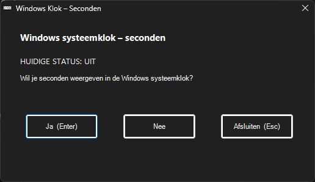

# ClockSecondsChooser
> Enable or disable seconds in the Windows system tray clock on Windows 10 and 11.

A small Windows GUI utility to enable or disable seconds in the system tray clock.

Designed for clarity, speed, and zero configuration.

---

## ✨ Features

- Clean GUI popup
- Shows current status (ON / OFF)
- Enable or disable seconds with one click
- Automatic Dark / Light mode detection
- Keyboard shortcuts  
  - **Enter** → Enable seconds  
  - **Esc** → Exit
- Restarts Explorer automatically (only when needed)
- No admin rights required
- Portable standalone EXE
- No background services or tray icons

---

## 🖼 Screenshots

### Main dialog (Dark Mode)

### Main dialog (Light Mode)

---

## 🚀 Usage

1. Download **ClockSecondsChooser.exe** from the **Releases** section
2. Double-click the executable
3. Choose **Yes** or **No**
4. The application closes automatically

---

## 📦 Repository Contents

- `ClockSecondsChooser.ps1` — PowerShell source code  
- `ClockSecondsChooser.exe` — compiled Windows executable  
- `clock.ico` — application icon  
- `screenshot.png` — dark mode preview  
- `screenshot2.png` — light mode preview  

---

## 🔒 License

MIT

---

## 👤 Author

**Raymond**  
GitHub: https://github.com/Rymnda  
